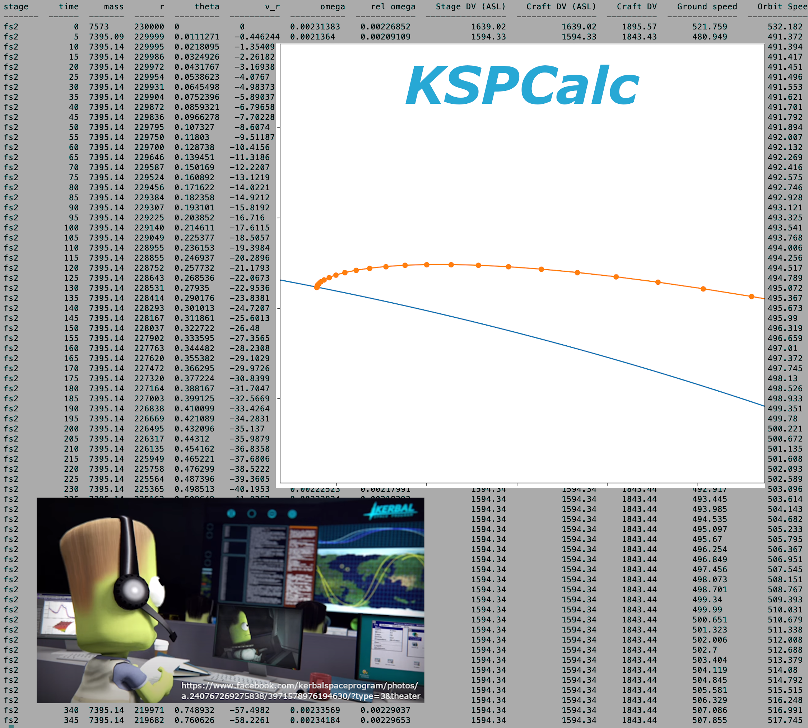
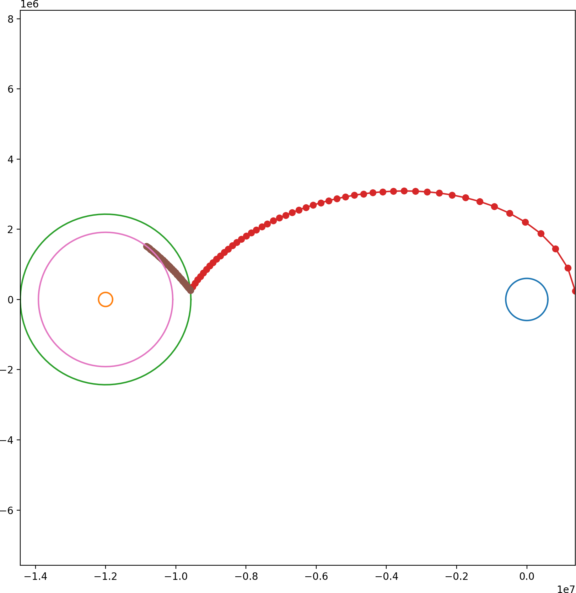

.. grotlib/python documentation master file, created by
   sphinx-quickstart on Sat Nov 28 11:36:01 2020.
   You can adapt this file completely to your liking, but it should at least
   contain the root `toctree` directive.

Python Libraries by Jonathan Grot
=================================

	   
.. toctree::
   :maxdepth: 2
   :caption: Contents:

   ksp
   drag_finder
   optim_dd
   mks_polar_motion
   moremath
   mpl_tools

   
Indices and tables
==================

* :ref:`genindex`
* :ref:`modindex`
* :ref:`search`
