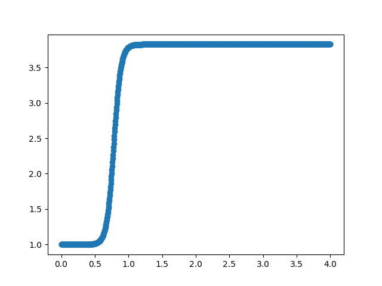

Drag Divergence Optimizer
=========================

Optimizing drag divergence is really only a thing while this library
is in development.  Once it is know, then there will likely not be a
need for this.  This optimizer is a start on trying to tease out the
exact drag divergence model that KSP is using.  I suppose I could just
Google it, but doing it experimentally is more fun.

Command Line Interface (CLI)
----------------------------
Run the CLI with
  ``$ optim_dd.py <command> <args>``

Use the argparse help system to get more details.
  ``$ optim_dd.py -h``
  
  ``$ optim_dd.py <command> -h``

The current list of commands is:

**inst**
  Prints brief instructions on how to use the drag divergence optimizer.

**test**
  Runs the drag optimizer test.

Finding Drag Divergence Coefficients
------------------------------------

Drag divergence is a scaling factor for the drag term.

This is still very much in the exploration stage and drag divergence
is a really complicated subject, particularly when the objective is to
master a video game (lol). My first attempt was to use Gaussians:

  if Mach number is <= 1.0:
  
  .. math::
     1.0 + c_0 e^{-c_1(v-1.0)^2}
     

  else:

  .. math::
     1.0 + c_0 e^{-c_2(v-1.0)^2}

and optimize c0, c1, c2.  This sort of worked, but the variability in
the coefficients between different missiles was a little too high for
this to be considered the correct functional form. Anyway, some
internet searching suggests that drag divergence has a form most
resembling a tanh form.  So the current formula is now:

  .. math::
     1.0 + {1 \over 2} c_0 ( 1.0 + tanh( c_1( v - c_2 ) ) )

The c2 term is the transition point (center of tanh transition).  The
c1 term determines the tightness of the transition.  The 1.0 added to
the tanh raises the range above y=0.  The 1/2 shrinks the range to 0 <
y < 1.  The c0 term is the amplitude.  The 1.0 added to whole thing is
the slow speed drag modifier (i.e. don't modify).

To find the c-terms, obtain the slow speed drag term (see
:doc:`drag_finder`).  Then run an experiment the same way as in
:doc:`drag_finder` but fast and high without damaging the craft.  You
will probably just go with the default fuel amount and full throttle.
Here are example files and commands:

ancAfast_test.json::
  
  { "nosecone name" : "Aerodynamic Nose Cone - Type A",
    "stage file"    : "ancAfast_stage.json",
    "htarget"       : 15298,
    "crash time"    : 140
  }

ancAfast_stage.json::
  
  {"m0": [4.096, "t"], "elist": [["RT-10", 1, 100, null]], "dragco": 0.51993179}

Test run::

  $ optim_dd.py test ancAfast_test.json

  ... lots of output ...
  
  iter:  222, c0:     2.8255, c1:     9.5443, c2:     0.7796, herr: 2.9087e-02, terr:      -0.90
  iter:  223, c0:     2.8255, c1:     9.5443, c2:     0.7796, herr: -3.2164e-03, terr:      -0.90
  iter:  224, c0:     2.8255, c1:     9.5443, c2:     0.7796, herr: -3.7052e-02, terr:      -0.90
  iter:  225, c0:     2.8255, c1:     9.5443, c2:     0.7796, herr: 8.6594e-03, terr:      -0.90
  iter:  226, c0:     2.8255, c1:     9.5443, c2:     0.7796, herr: -1.2966e-02, terr:      -0.90
  iter:  227, c0:     2.8255, c1:     9.5443, c2:     0.7796, herr: -9.7618e-03, terr:      -0.90
  [2.82551746 9.54428153 0.77963552]

At the end of the run, you get a plot of the drag divergence vs Mach number:

Once you are confident you have a good set of coefficients, add them to the experimental results in the DragDivergence class!::
  
  # optim_dd.py experiments to determine parameters:
  #
  experiments = [ ["ancA", 2.82551746, 9.54428153, 0.77963552],
                  ["anc",  2.84071867, 9.55284246, 0.77831561] ]

