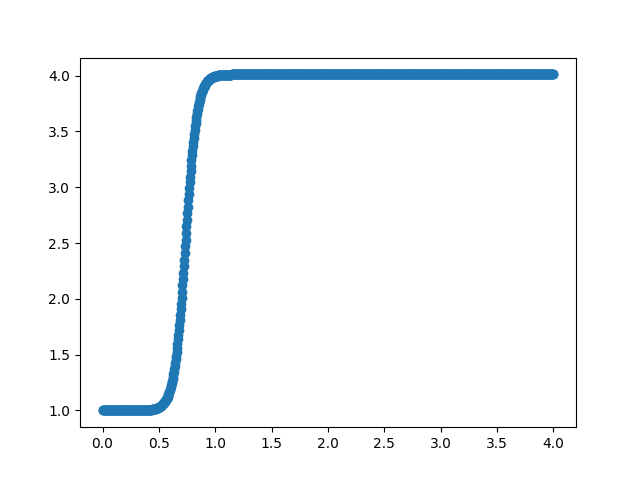

Drag Divergence Optimizer
=========================

This optimizer is a start on trying to tease out the exact drag
divergence model that KSP is using.  I suppose I could just Google it,
but doing it experimentally is more fun.

Command Line Interface (CLI)
----------------------------
Run the CLI with
  ``$ optim_dd.py <command> <args>``

Use the argparse help system to get more details.
  ``$ optim_dd.py -h``
  
  ``$ optim_dd.py <command> -h``

The current list of commands is:

**inst**
  Prints brief instructions on how to use the drag divergence optimizer.

**test**
  Runs the drag optimizer test.

Finding Drag Divergence Coefficients
------------------------------------

Drag divergence is a scaling factor for the drag term.

This is still very much in the exploration stage and drag divergence
is a really complicated subject, particularly when the objective is to
master a video game (lol). My first attempt was to use Gaussians:

  if Mach number is <= 1.0:
  
  .. math::
     1.0 + c_0 e^{-c_1(v-1.0)^2}
     

  else:

  .. math::
     1.0 + c_0 e^{-c_2(v-1.0)^2}

and optimize c0, c1, c2.  This sort of worked, but the variability in
the coefficients between different missiles was a little too high for
this to be considered the correct functional form. Anyway, some
internet searching suggests that drag divergence has a form most
resembling a tanh form.  So the current formula is now:

  .. math::
     1.0 + {1 \over 2} c_0 ( 1.0 + tanh( c_1( v - c_2 ) ) )

The c2 term is the transition point (center of tanh transition).  The
c1 term determines the tightness of the transition.  The 1.0 added to
the tanh raises the range above y=0.  The 1/2 shrinks the range to 0 <
y < 1.  The c0 term is the amplitude.  The 1.0 added to whole thing is
the slow speed drag modifier (i.e. don't modify).

To find the c-terms, obtain the slow speed drag term (see
:doc:`drag_finder`).  Then run an experiment the same way as in
:doc:`drag_finder` but fast and high.  You will probably just go with
the default fuel amount and full throttle.  Here are example files
and commands:

ancAfast_test.json::
  
  { "nosecone name" : "Aerodynamic Nose Cone - Type A",
    "stage file"    : "ancAfast_stage.json",
    "htarget"       : 15298,
    "crash time"    : 140,
    "throttle"      : 1.0
  }

ancAfast_stage.json::
  
  {"m0": [4.096, "t"], "elist": [[1, "RT-10"]], "dragco": 0.45102539 }

Test run::

  $ optim_dd.py test ancAfast_test.json

  iter:    1, c0:     3.0000, c1:    10.0000, c2:     0.7000, herr: -7.4083e+02, terr:      -6.20
  iter:    2, c0:     3.1500, c1:    10.0000, c2:     0.7000, herr: -1.0292e+03, terr:      -7.50
  iter:    3, c0:     3.0000, c1:    10.5000, c2:     0.7000, herr: -7.7052e+02, terr:      -6.40
  iter:    4, c0:     3.0000, c1:    10.0000, c2:     0.7350, herr: 1.4534e+01, terr:      -3.00
  iter:    5, c0:     2.8500, c1:    10.3333, c2:     0.7233, herr: 3.6100e+01, terr:      -2.90
  iter:    6, c0:     2.9000, c1:     9.7222, c2:     0.7389, herr: 3.2456e+02, terr:      -1.60

  ...

  iter:  172, c0:     3.0113, c1:     9.9276, c2:     0.7351, herr: 3.5064e-02, terr:      -3.00
  iter:  173, c0:     3.0113, c1:     9.9276, c2:     0.7351, herr: -2.7270e-02, terr:      -3.00
  iter:  174, c0:     3.0113, c1:     9.9276, c2:     0.7351, herr: 2.7893e-02, terr:      -3.00
  iter:  175, c0:     3.0113, c1:     9.9276, c2:     0.7351, herr: 1.7895e-02, terr:      -3.00
  iter:  176, c0:     3.0113, c1:     9.9276, c2:     0.7351, herr: -7.0845e-03, terr:      -3.00
  iter:  177, c0:     3.0113, c1:     9.9276, c2:     0.7351, herr: -1.9827e-03, terr:      -3.00
  [3.01128474 9.92764216 0.73508828]

At the end of the run, you get a plot of the drag divergence vs Mach number:

